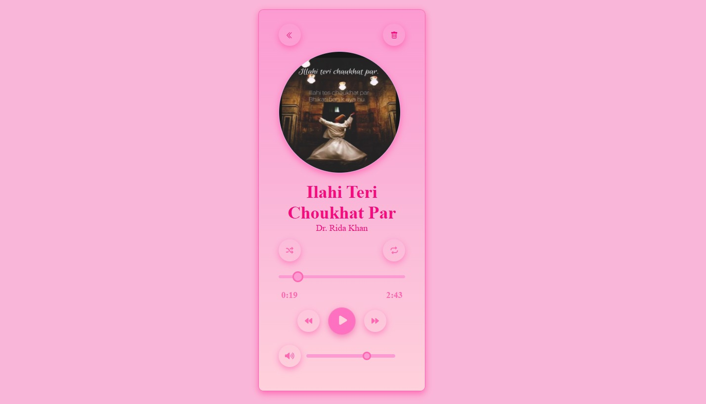

# 🎵 **Audio Player**
*A modern responsive audio player built with HTML, CSS & JavaScript.*

## 🎵 Screenshots

  

  

## 📌 **Overview**

The **Audio Player** is a beautifully designed, fully responsive, feature-rich music player UI built using **vanilla HTML, CSS, and JavaScript**.
It includes playlist management, volume controls, loop modes, delete confirmation, and smooth UI animations — all wrapped in a soft pink glassmorphism theme.

## 🚀 **Features**

### 🎶 Core Player

* ▶️ **Play / Pause**
* ⏮️ **Previous Track**
* ⏭️ **Next Track**
* 🔁 **Loop Toggle (ON/OFF)**
  — Single click enables loop
  — Clicking again disables it
  — Button color changes when active
* 🔄 **Replay Functionality**

### 🗑️ Song Management

* **Delete any song** via confirmation popup
  — Prevents accidental removal
  — Works on both main player & playlist view

### 📃 Playlist System

* Clean list view of all songs
* Tap any track to load it instantly
* Back button returns to the main player
* Each song includes its own delete icon with confirmation

### 🔊 Volume Control

* Smooth volume slider
* Supports volume up, down, and full mute
* Real-time icon / slider updates

### 📱 Responsive Design

* Fully responsive on:

  * Mobile
  * Tablets
  * Desktop
* Touch-friendly buttons
* Optimized layout scaling

### 🎨 UI / UX

* Soft pink gradient theme
* Glass-morphism style cards
* Smooth hover and active animations
* Rounded, glowing control buttons

